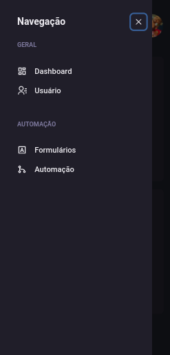

# Introdução
O dashgo é uma simples aplicação de dashboard que aplica conceito de estilização declarativa.


Criada para ser uma aplicação responsiva:

 

# Detalhes técnicos

## Lidando com formulários no react.

### Controled components

São componentes controlados pelo estado, usando ```useState()```. A forma mais tradicional de usar formulários no react que é usando o uma state no valor do **value** de um input, por exemplo, e ouvindo o evento **onChange**

### Uncontroled components

Dessa forma acessaremos o valor do elemento apenas quando queremos acessar, em vez de monitorar a cada input de caracter ou mudança de seu valor. Usaremos essa abordagem nesse projeto.  
É possível criar uncontroled components usando refs de forma imperativa.